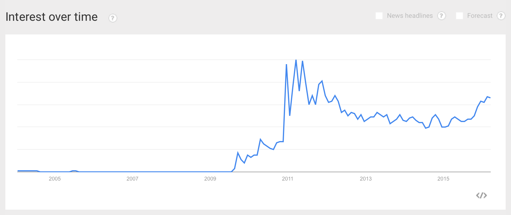

# Ecosystem

## Books

There are about 200 results returned for searching "WebGL" on amazon.com.
As a comparison, searching "JavaScript" gives you 9000+ results.

The most popular books are:

#### *WebGL Programming Guide: Interactive 3D Graphics Programming with WebGL (OpenGL)* by Kouichi Matsuda and Rodger Lea [ref #3]:

> You’ll move from basic techniques such as rendering, animating, and texturing triangles, all the way to advanced techniques such as fogging, shadowing, shader switching, and displaying 3D models generated by Blender or other authoring tools. This book won’t just teach you WebGL best practices, it will give you a library of code to jumpstart your own projects.

#### *Learning Three.js: The JavaScript 3D Library for WebGL* by Jos Dirksen [ref #4]:

> If you know JavaScript and want to start creating 3D graphics that run in any browser, this book is a great choice for you. You don't need to know anything about math or WebGL; all that you need is general knowledge of JavaScript and HTML.

#### *Programming 3D Applications with HTML5 and WebGL: 3D Animation and Visualization for Web Pages* by Tony Parisi [ref #5]:

> In two parts—Foundations and Application Development Techniques—author Tony Parisi provides a thorough grounding in theory and practice for designing everything from a simple 3D product viewer to immersive games and interactive training systems. Ideal for developers with Javascript and HTML experience.

#### *WebGL: Up and Running* by Tony Parisi [ref #6]:

> You don’t have to be a game development wizard or have 3D graphics experience to get started. If you use HTML, CSS, and JavaScript—and have familiarity with JQuery and Ajax—this book will help you gain a working knowledge of WebGL through clear and simple examples.

#### *WebGL Insights* by Patrick Cozzi [ref #7]:

> WebGL Insights shares experience-backed lessons learned by the WebGL community. It presents proven techniques that will be helpful to both intermediate and advanced WebGL developers.

It seems apparent that advanced materials share a high proportion. Also, one books is not really teaching WebGL but Three.js.

These popular books' publication dated range from 2012 to 2015; In all books, the newest is published in Feb 12, 2016 while the oldest is in Oct 5, 2011 as I found.

## Tutorials
Google gives me about 373,000 results for "WebGL tutorial" (28,900,000 for "JavaScript" at the same time).

The popular ones are:

1. [MDN tutorial](https://developer.mozilla.org/en-US/docs/Web/API/WebGL_API/Tutorial)
2. [LearningWebGL](http://learningwebgl.com/blog/)
3. [WebGL Academy](http://www.webglacademy.com)
4. [WebGL Fundamentals](https://webglfundamentals.org)

## Misc

* Google Trend for "WebGL" 
* High-level libraries: BabylonJS, three.js, O3D, OSG.JS, CopperLicht and GLGE
* Game engines:  Unreal Engine 4 and Unity 5
* Languages:
    * JavaScript (native)
    * [TypeScript](http://typescript.away3d.com)
    * [PureScript](https://github.com/jutaro/purescript-webgl)
    * [CoffeeScript](http://www.coffeegl.com)
    * [Haxe](http://haxor.xyz)
