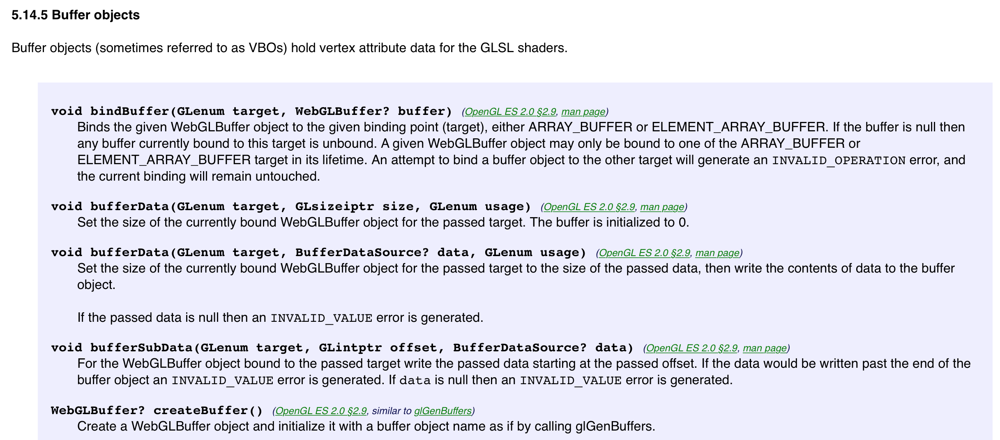
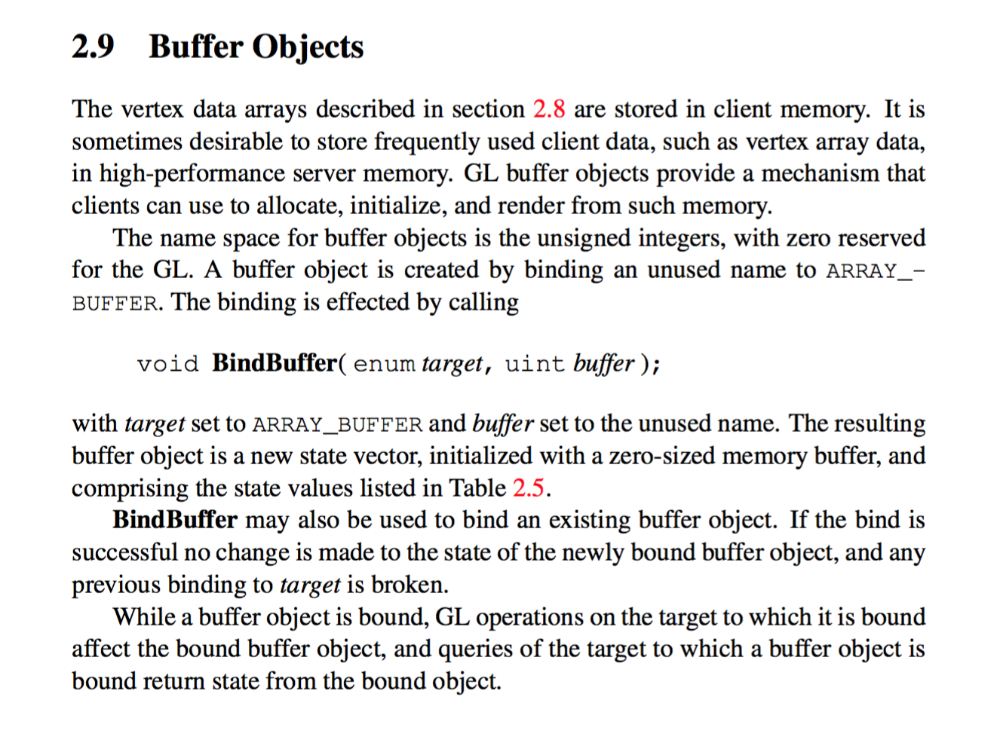

# 1.1 WebGL and OpenGL standard

## Evolving of the standards
The publication and draft dates of WebGL specification:

+ Version 1.0, 10 February 2011
+ Version 1.0.1, 27 January 2012
+ Version 1.0.2, 01 March 2013
+ Version 1.0.3, 27 October 2014
+ Version 2.0, 19 February 2016 (latest draft)

NOTE: Version 1.x are based on OpenGL ES 2.0; Version 2.x are based on OpenGL ES 3.0.

NOTE:The 2.0 draft spec [provided here](https://www.khronos.org/registry/webgl/specs/latest/2.0) should be read as an extension to the WebGL 1.0 specification. It will only describe the differences from 1.0.

## Information in the standards
### WebGL
In [WebGL spec](https://www.khronos.org/registry/webgl/specs/latest/1.0/), it introduces *Context Creation* and *Drawing Buffer Presentation*, *WebGL Resources* and *Security* only briefly. The major parts are: *DOM Interfaces* and *Differences with OpenGL ES 2.0*.

In DOM interfaces, the types and various object interfaces are introduced, in which the `WebGLRenderingContext` is the biggest one. The IDLs are presented here, and its intended semantics are described. However, it refers OpenGL ES 2.0 frequently and don't give a lot of information which appears in the OpenGL spec.

Here is a sample spec:

### OpenGL ES

The [OpenGL ES 2.0 spec](https://www.khronos.org/registry/gles/specs/2.0/es_full_spec_2.0.25.pdf) is a rather detailed specification. Some implementation contrives are explained. So it is necessary for understanding the browser implementation.

Here is a sample spec:

### Example Implementation

As an example of implementation, we will see part of code in Firefox's Browser Engine -- Gecko.

* [`WebGLRenderingContext.webidl`](https://github.com/mozilla/gecko-dev/blob/5a7da7930ebba958d98e2e42ed07d05c34d1873a/dom/webidl/WebGLRenderingContext.webidl)
* [`RendererGL.h`](https://github.com/mozilla/gecko-dev/blob/71900c9741a8fafb137d9a57519dfa0fe280c4dc/gfx/angle/src/libANGLE/renderer/gl/RendererGL.h)
* [`WebGLContextBuffers.cpp`](https://github.com/mozilla/gecko-dev/blob/7a82450687cc47dad34e3c89ca94cbd60bfd1aa6/dom/canvas/WebGLContextBuffers.cpp)

## Conformity status of popular implementations
Older but more completed from [ref #1].

### Desktop browsers
* Google Chrome – WebGL has been enabled on all platforms that have a capable graphics card with updated drivers since version 9, released in February 2011.
* Mozilla Firefox – WebGL has been enabled on all platforms that have a capable graphics card with updated drivers since version 4.0.
* Safari – Safari 6.0 and newer versions installed on OS X Mountain Lion, Mac OS X Lion and Safari 5.1 on Mac OS X Snow Leopard implemented support for WebGL, which was disabled by default before Safari 8.0.
* Opera – WebGL has been implemented in Opera 11 and 12, although was disabled by default in 2014.
* Internet Explorer – WebGL is partially supported in Internet Explorer 11.
* Microsoft Edge – The initial stable release supports WebGL version 0.95 (context name: "experimental-webgl").

### Mobile browsers
* BlackBerry 10 – WebGL is available for BlackBerry devices since OS version 10.00
* BlackBerry PlayBook – WebGL is available via WebWorks and browser in PlayBook OS 2.00
* Android Browser – Basically unsupported.
* Internet Explorer - WebGL is available on Windows Phone 8.1
* Firefox for mobile – WebGL is available for Android and MeeGo devices since Firefox 4.
* Firefox OS
* Google Chrome – WebGL is available for Android devices since Google Chrome 25 and enabled by default since version 30.
* Maemo – In Nokia N900, WebGL is available in the stock microB browser from the PR1.2 firmware update onwards.
* MeeGo - WebGL is unsupported in the stock browser "Web." However, it is available through Firefox.
* Opera Mobile - Opera Mobile 12 supports WebGL (on Android only).
* Sailfish OS - WebGL is supported in the default Sailfish browser.
* Tizen - WebGL is supported
* Ubuntu Touch
* WebOS
* iOS – WebGL is available for mobile Safari, in iOS 8.

### More updated information

You can check out the updated information in MDN [ref #2]

> Support for WebGL is present in Firefox 4+, Google Chrome 9+, Opera 12+, Safari 5.1+ and Internet Explorer 11+; however, the user's device must also have hardware that supports these features.
