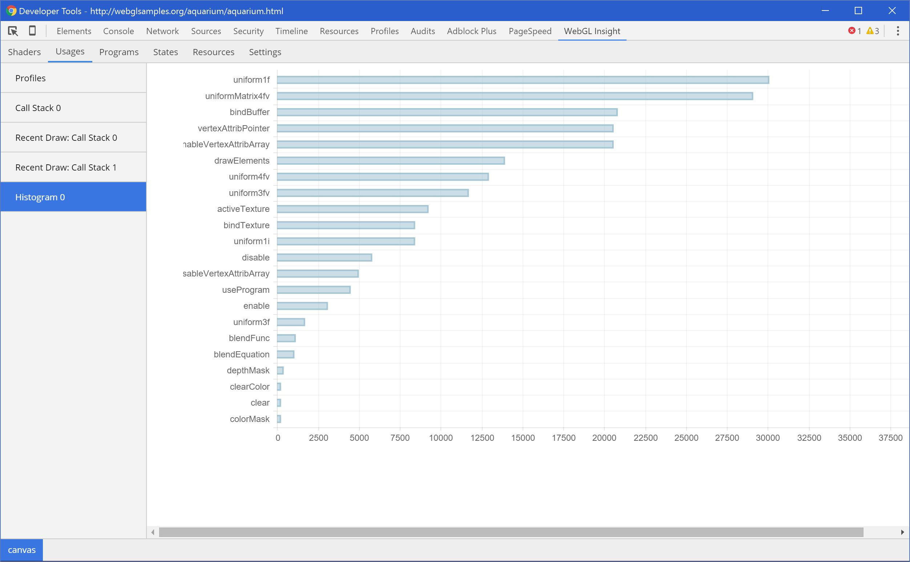
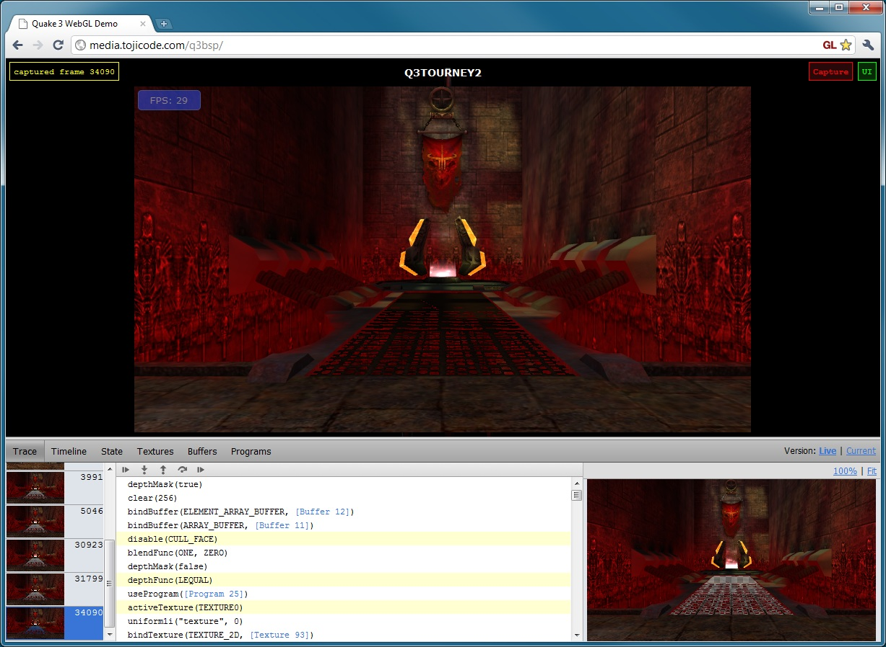

# Exclusive Debug tools

> Some debugging tools for WebGL development are listed here.

[Another post](http://www.realtimerendering.com/blog/webgl-debugging-and-profiling-tools/)

## WebGL Insights
[Home](https://github.com/3Dparallax/insight)

This tool looks very powerful and mature. Look at the features:

* Chrome Extension embedded in the Chrome DevTools panel
* Overdraw Inspector
* Mipmap Inspector
* Depth Inspector
* Call Stack Timeline and Statistics
* Program Usage Count
* Duplicate Program Usage Detector
* Program Viewer
* Frame Control
* State Variable Editor
* Resource Viewer

One screen-shot:

## WebGL-Inspector
[Home](https://benvanik.github.com/WebGL-Inspector/)

Features

* Extension for injecting into pages
* Embed in an existing application with a single script include
* Capture entire GL frames
* Annotated call log with stepping/resource navigation and redundant call warnings
* Pixel history - see all draw calls that contributed to a pixel + blending information
* GL state display
* Resource browsers for textures, buffers, and programs

[Demo](http://benvanik.github.io/WebGL-Inspector/samples/lesson05/embedded.html)

This is a very convenient debugger, it can be useful when you application's logic is wrong (compared to our analyzer's target -- the syntax and API is wrong).

## webgl-debug.js
* [Repo](https://github.com/KhronosGroup/WebGLDeveloperTools)
* [Home](https://www.khronos.org/webgl/wiki/Debugging)

It will wrap the `WebGLRenderingContext` with a debugging wrapper, which will make any GL errors show up in the JavaScript console of browser.

Also, we can log function calls with by passing a logger in the above mentioned wrapper.

It provides [a sample](https://github.com/KhronosGroup/WebGLDeveloperTools/blob/master/src/debug/debug-sample.html).

## WebGL Linter
[Repo](https://github.com/CharlesLillo/WebGL_Linter)

This is a discontinued and very primitive project -- but the idea is there.
